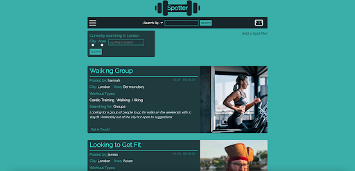
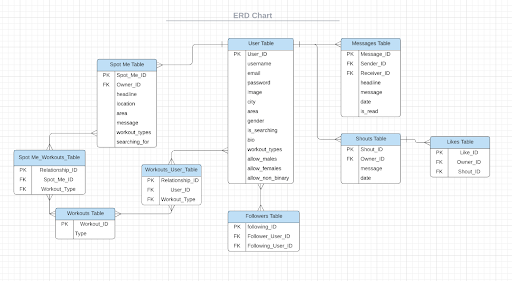
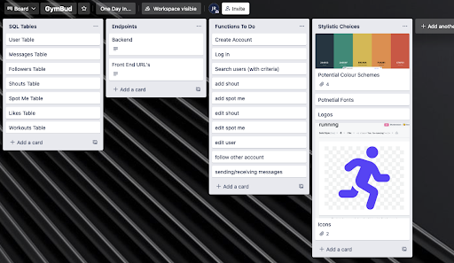
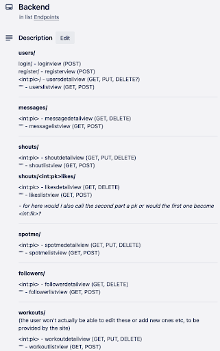
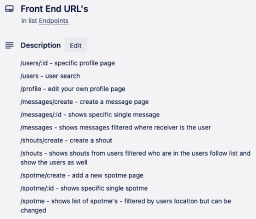

# Spotter #

Solo Project  
Time Frame: 9 days  
Visit the site: (not deployed yet)  

Login Credentials:  
Email: james@james.com   
Password: jimmypass  
(if login fails, please clear cookies and try again)  

## Overview: ##

This was my final project for General Assembly’s software engineering course. I was tasked with individually building a full-stack application myself, using everything I had learned across the course. After struggling to come up with an idea, I eventually landed on a social media site where users could search for people to accompany them on workouts, be it in the gym or going for a run or a hike.

## The Brief: ##

* **Build a full-stack application** by making your own back-end and your own front-end.
* **Use a Python Django API** using Django REST Framework to serve your data from a Postgres database.
* **Consume your API with a separate front-end** built with React.
* **Be a complete product** which most likely means multiple relationships and CRUD functionality for at least a couple of models.
* **Implement thoughtful user stories/wireframes** that are significant enough to help you know which features are core MVP and which you can cut.
* **Be deployed online** so it's publicly accessible.

## Technologies Used: ##

* Python
* Django
* Django REST Framework
* Psycopg2
* pyJWT
* React
* React Bootstrap
* Cloudinary
* Axios
* SASS
* Nodemon
* Yarn
* Insomnia
* Git
* GitHub
* Trello
* Postbird
* Lucid Chart

## Code Installation: ##

* Clone or download the repo, then in your terminal run the following commands:
* Install back-end dependencies: `pipenv`
* Enter Shell for project: `pipenv shell`
* Make Migrations: `python manage.py makemigrations`
* Migrate: python `manage.py migrate`
* Start the back-end server first running: `python3 manage.py runserver`
* Start the front-end by first running: `cd client` followed by: `yarn` and then: `yarn start`

## Day 1 - Planning: ##

Once I had the idea down I got to work on planning my models and the relationships between them. I originally used Excel to map them out before moving on to lucidchart.com to create a professional ERD diagram.

With that made I moved over to trello to set up a board for my project. It was here where I went into greater detail about each model and what sorts of information would be stored within them. It was also here that I mapped out my endpoints for my back-end, as well as my URL’s for my front-end. This meant when I later came to creating back-end functionality, I had a simple checklist to use to ensure I had everything I needed. Likewise when I created my front-end, I could easily add my URL’s into the router as I had already thought them through early.

  
  
  

Finally, I got to work on some wireframes, which I stuck to my wardrobe door next to my desk to refer to throughout the process. Creating these early helped me establish which information I needed within each model, as well as helped me assign each part into different divs and sections to better style the pages at a later date.

Once I had done all of this, I got the project sign off and was ready to begin building.

## Days 2 & 3 - Building the back-end: ##

The very first thing I had to do with the back-end was create a new user model to override the default one offered by Django. It was important to do this right at the start as otherwise I would have run into issues when making migrations at a later date. The most complicated part of this process was in order to have a followers relationship, I needed the user model to have a ‘many-to-many’ relationship with itself, something I hadn’t been shown. After searching online I found the way to do this, opting to make the relationship non-symmetrical (so following a user would not necessarily mean they were following you).

