# Spotter #

Solo Project  
Time Frame: 9 days  
Visit the site: https://bit.ly/jrspotter  

Login Credentials:  
Email: james@james.com   
Password: jimmypass  
(if login fails, please clear cookies and try again)  

## Overview: ##

This was my final project for General Assembly’s software engineering course. I was tasked with individually building a full-stack application myself, using everything I had learned across the course. After struggling to come up with an idea, I eventually landed on a social media site where users could search for people to accompany them on workouts, be it in the gym or going for a run or a hike.


## The Brief: ##

* **Build a full-stack application** by making your own back-end and your own front-end.
* **Use a Python Django API** using Django REST Framework to serve your data from a Postgres database.
* **Consume your API with a separate front-end** built with React.
* **Be a complete product** which most likely means multiple relationships and CRUD functionality for at least a couple of models.
* **Implement thoughtful user stories/wireframes** that are significant enough to help you know which features are core MVP and which you can cut.
* **Be deployed online** so it's publicly accessible.


## Technologies Used: ##

* Python
* Django
* Django REST Framework
* Psycopg2
* pyJWT
* React
* React Bootstrap
* Cloudinary
* Axios
* SASS
* Nodemon
* Yarn
* Insomnia
* Git
* GitHub
* Trello
* Postbird
* Lucid Chart


## Code Installation: ##

* Clone or download the repo, then in your terminal run the following commands:
* Install back-end dependencies: `pipenv`
* Enter Shell for project: `pipenv shell`
* Make Migrations: `python manage.py makemigrations`
* Migrate: python `manage.py migrate`
* Start the back-end server first running: `python3 manage.py runserver`
* Start the front-end by first running: `cd client` followed by: `yarn` and then: `yarn start`


## Day 1 - Planning: ##

Once I had the idea down I got to work on planning my models and the relationships between them. I originally used Excel to map them out before moving on to lucidchart.com to create a professional ERD diagram.


With that made I moved over to Trello to set up a board for my project. It was here where I went into greater detail about each model and what sorts of information would be stored within them. It was also here that I mapped out my endpoints for my back-end, as well as my URL’s for my front-end. This meant when I later came to creating back-end functionality, I had a simple checklist to use to ensure I had everything I needed. Likewise when I created my front-end, I could easily add my URL’s into the router as I had already thought them through early.


  
  
  

Finally, I got to work on some wireframes, which I stuck to my wardrobe door next to my desk to refer to throughout the process. Creating these early helped me establish which information I needed within each model, as well as helped me assign each part into different divs and sections to better style the pages at a later date.

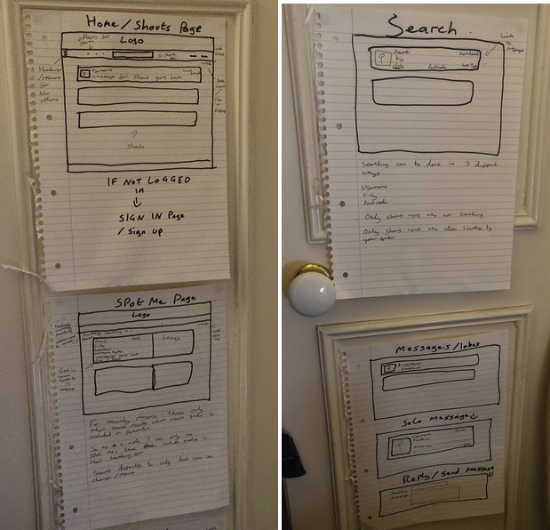

Once I had done all of this, I got the project sign off and was ready to begin building.


## Days 2 & 3 - Building the Back-End: ##

The very first thing I had to do with the back-end was create a new user model to override the default one offered by Django. It was important to do this right at the start as otherwise I would have run into issues when making migrations at a later date. The most complicated part of this process was in order to have a followers relationship, I needed the user model to have a ‘many-to-many’ relationship with itself, something I hadn’t been shown. After searching online I found the way to do this, opting to make the relationship non-symmetrical (so following a user would not necessarily mean they were following you).

```
class User(AbstractUser):
    email = models.CharField(max_length=30, unique=True)
    image = models.CharField(max_length=200, blank=True,
                             default='https://i.pinimg.com/236x/38/aa/95/38aa95f88d5f0fc3fc0f691abfaeaf0c.jpg')
    city = models.CharField(max_length=30, blank=True)
    postcode = models.CharField(max_length=30, blank=True)
    gender = models.CharField(max_length=12, blank=True)
    isSearching = models.BooleanField(default=True)
    bio = models.TextField(max_length=250, blank=True)
    allowMales = models.BooleanField(default=True)
    allowFemale = models.BooleanField(default=True)
    allowNonBinary = models.BooleanField(default=True)
    workoutTypes = models.ManyToManyField("workouts.Workout", blank=True)
    following = models.ManyToManyField(
        "jwt_auth.User", related_name="followers", blank=True)
```

Once I had created this model I was free to make the others, constantly testing them using the admin function provided by Django and Postbird to ensure they were built correctly and filled with the correct data. Once I had all my models, I got to work making my back-end functionality. In total, I made 24 different back-end functions. Not all of these would be needed by the user, but would be needed by me to build the site. I tested them all on Insomnia to ensure they were working correctly, confirming the changes using the Django admin function.


Of all the functions, the follower ones were the hardest to make. I had to do some more research for how to create these relationships, as it was a ‘many-to-many’ relationship between the user model and itself. In the end I realised that whereas most requests to create something are post requests, and delete requests handle deletion, in this instance I actually had to use a put request to edit the user as opposed to creating or deleting anything new.

```
class AddFollowerView(APIView):

    def put(self, request, pk):
        u1 = User.objects.get(id=request.user.id)
        u2 = User.objects.get(id=pk)
        u1.following.add(u2)
        u1.save()
        serialized_u1 = PopulatedUserSerializer(u1)
        return Response(serialized_u1.data, status=status.HTTP_201_CREATED)


class DeleteFollowerView(APIView):

    def put(self, request, pk):
        u1 = User.objects.get(id=request.user.id)
        u2 = User.objects.get(id=pk)

        u1.following.remove(u2)
        u1.save()
        serialized_u1 = PopulatedUserSerializer(u1)
        return Response(serialized_u1.data, status=status.HTTP_202_ACCEPTED)
   ```
    
## Days 4, 5, 6, 7 & 8 - Creating the Front-End: ##

With the back-end functionality created, I got to work on the front-end. I originally ran into a problem that plagued me for a few days where some of my API requests would not work properly when called in the front-end. In the end this came down to be a mix-up with cors headers and soon enough everything was working properly (this is why when logging in there can be an issue if you have the cors headers in your cookies).

After that issue was resolved I got to work building all the functionality and pages, running through my lists on Trello for maximum efficiency. At first I left the ‘like’ feature on the Shouts, as I was aware my project was quite large in size and I deemed this was the least important factor, and so moved it to becoming more of a stretch goal.

Inspired by my idea in the last project to use the local storage to help with some of my functions, I used this again to this time store the user ID, their city and their gender.

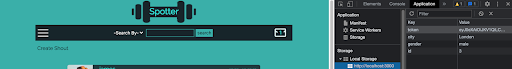

This came in especially handy due to the security features I had built in for the user. I was aware that gym culture can sometimes have a negative image, and women can sometimes feel uncomfortable working out around men. As such I built features into this site where users could block themselves from showing up in any searches from someone of a particular gender. I also allowed them to block themselves from showing up in any searches whatsoever, a feature I imagined could be used if someone was satisfied with their current workout partners and still wanted to be able to message them, but didn’t want to be hassled by other members on the site.

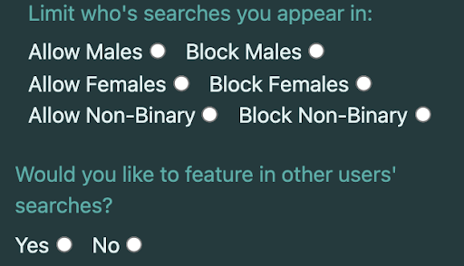

To achieve this I had to run a number of filters on the search results. First I needed to clarify what type of search was being run and filter the results accordingly. After this I ran through the different gender options to ensure the results only featured members who were happy to be viewed by the user’s gender. Finally, I ran two more filters. The first to remove anyone who had selected they didn’t want to appear in a search, before also removing the user themselves.

```
const searchType = getSearchType()
   const search = getSearch()
   const userGender = getGender()
   const userId = getUserId()
   let filteredUsers = []
   let filteredGenderUsers = []
 
 
   const getData = async () => {
     const res = await axios.get('/api/users/')
     if (searchType === 'username'){
       filteredUsers = res.data.filter(user => user.username.toLowerCase() === search.toLowerCase())
     } else if (searchType === 'location'){
       filteredUsers = res.data.filter(user => user.city.toLowerCase() === search.toLowerCase())
     } else if (searchType === 'postcode'){
       filteredUsers = res.data.filter(user => user.postcode.toLowerCase() === search.toLowerCase())
     }
    
     if (userGender === 'male'){
       filteredGenderUsers = filteredUsers.filter(user => user.allowMales === true)
     } else if (userGender === 'female'){
       filteredGenderUsers = filteredUsers.filter(user => user.allowFemales === true)
     } else if (userGender === 'non-binary'){
       filteredGenderUsers = filteredUsers.filter(user => user.allowNonBinary === true)
     }
 
     const filteredSearchingUsers = filteredGenderUsers.filter(user => user.isSearching === true)
     const removeUserFromSearch = filteredSearchingUsers.filter(user => user.id !== Number(userId))
      setUsers(removeUserFromSearch)
   }
   getData()
   ```
   
   I also had to implement this filter or similar versions of it to the Shouts and Spot Me page, although for the Shouts I made it so the user could only see posts from users they follow, and for both pages I didn’t then filter out the user themselves.

I also took inspiration from some of the things I didn’t manage to feature in my last project due to time constraints, namely having the user be able to set a profile picture, and attempting to fill a form with prior details when editing something. For the profile pictures I used Cloudinary, and for the forms I had the old information stored as the placeholder for each input.

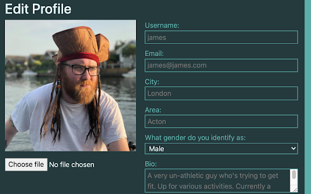

I was also keen to use React Bootstrap, having seen one of my team members use it in the last project to create a hamburger. I also used this technique to create a navbar that was hidden offscreen unless called upon.

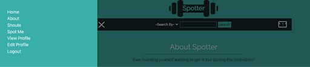

The other Bootstrap component I was keen to use was a modal, as this was something we briefly looked at in the last project but quickly decided we didn’t have time to implement it. I found the details on the documentation and after a short time was able to use modal boxes for creating Shouts, and also for sending messages to another user.

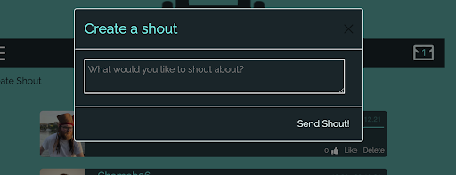

Of all the features I added to the site, I think the one I was most proud of was adding in a messaging feature on the side. A lot of work went into this to add in all the little details that made it work so well. For example, all messages had a field called isRead which by default was set to false. Therefore all messages that came through were unread messages, which meant they were included in the counter on the nav bar and also were styled differently from a read message. The biggest difference between the two types of message was that a read message simply had a link you clicked on that took you to that single message’s page. An unread message instead ran a function that first toggled the value of the isRead field, and then directed the user to the single message’s page, meaning the next time they came back to their inbox the message would be marked as read.

The toggle could also be run the other way when the user pressed the ‘Mark as Read’ button, which simply ran the same toggle as above and then reloaded the page.

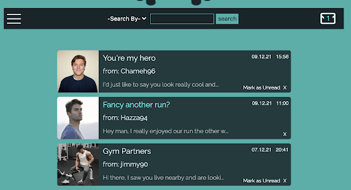

## Days 8 & 9 - Styling: ##

After I had built all the functionality listed in my Trello board, it was time to move onto styling. I had looked up a number of colour schemes and stored their values on Trello so I could easily save them as variables using SASS. I was somewhat torn over what colour scheme to go for, as when it comes to fitness there seems to be a split between dark backgrounds with reds/oranges for gym sites, and white backgrounds with blues or light greens for fitness sites. As my last two projects had featured white backgrounds with blues, I was keen to try something different, and so in the end went for a combination of the two, with the light green serving as the background colour and a darker one used for the components.

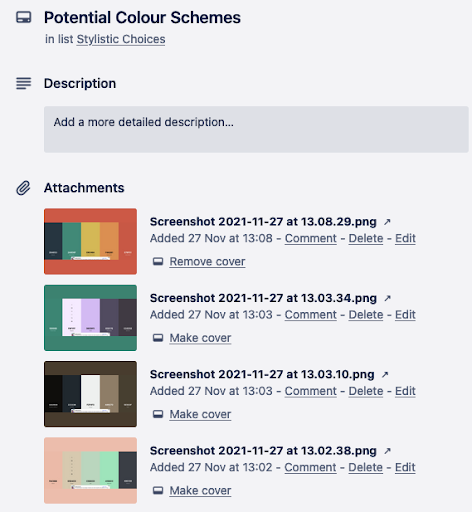

The styling was made somewhat more complicated due to React Bootstraps styling conflicting with my own, but I was able to override it and got everything looking the way I wished, including the hamburger and modal boxes that were implemented through bootstrap.

## Final Product: ##


#### Home Page ####

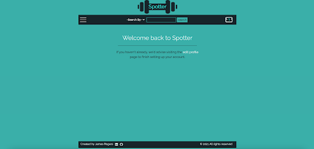

#### About Page ####

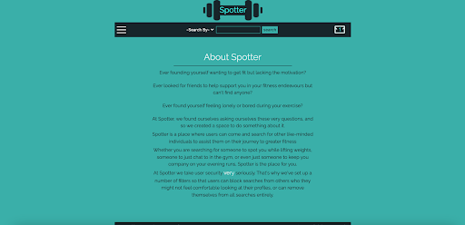

#### Shouts Page ####

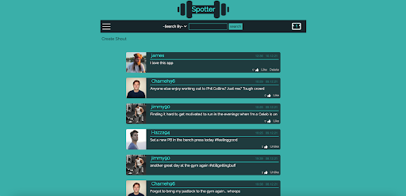

#### Spot Me Page ####

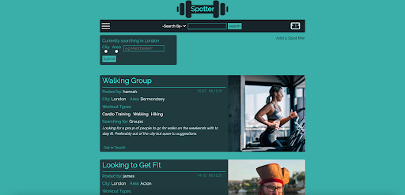

#### Profile Page ####

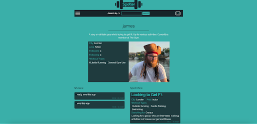

#### Edit Profile Page ####

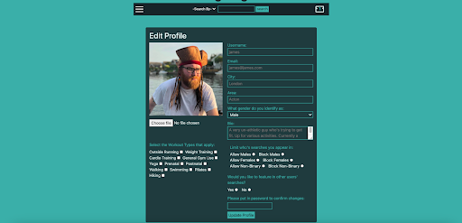

#### Inbox ####

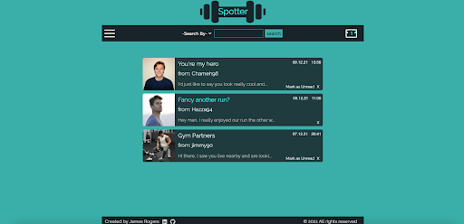

#### Single Message ####

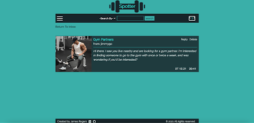

#### Send Message ####

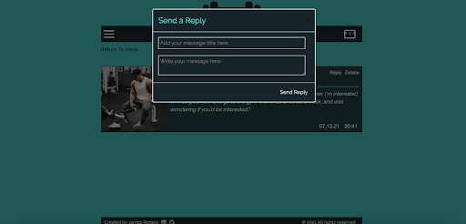

#### Create Spot Me ####

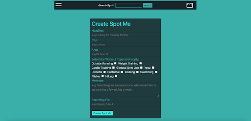

#### Send Shout ####

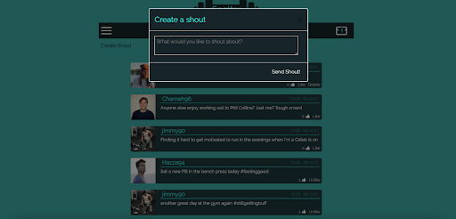

#### Register Page ####

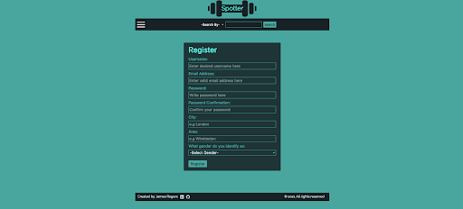

#### Sign In Page ####

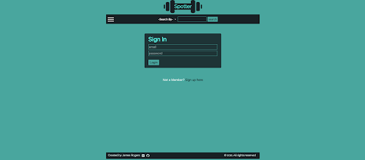


## Wins & Blockers: ##

I’d say again, my main win was that I got everything included in this project that I had set out to do, and everything worked very smoothly for my presentation. When I originally pitched the idea, I was warned that I might have taken on a bit too much, especially with all the different models and relationships I was including, and was warned to maybe take some of them out of my MVP. In the end, managing to include everything felt like a great achievement. I also wasn’t that confident using Django at the start of this project, and felt confused as to why an SQL database would be better than MongoDB as we had used before, but by the end of this project I definitely had a new appreciation for Django and what it could do.

As for blockers, I’d say one of them came in the form of styling. I am very confident with CSS and SASS. If I am tasked with re-creating something, I feel confident I can do it and make an exact copy, but when it comes to designing from scratch for this project I kept coming up with a lot of blanks, so the process took me a lot longer than I would have liked.

Also the issue with the CORS headers preventing some of my functions plagued me for a few days. I got around it by manually adding a token and other information into my local storage, effectively faking that I was logged in, but that definitely set me back somewhat.


## Bugs: ##

* The indicator for how many unread messages you have doesn’t update instantly, and needs you to change the page for it to take effect.
* If you change the search parameters on the Spot Me page and then reload the page, the search defaults back to the user’s city as opposed to the last search they entered.


## Key Learnings: ##

* I feel I have gained a much stronger appreciation for SQL databases and the benefits they offer.
* Implementing components from React Bootstrap to help elevate my project.
* Using Python for the first time.


## Future Content: ##

* Mobile View.
* Having the search and shouts page update without relying on a page reload.
* Add a space for personal trainers to advertise their services.
